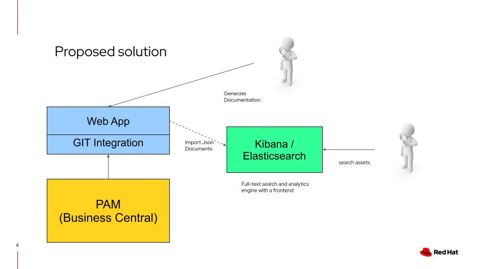
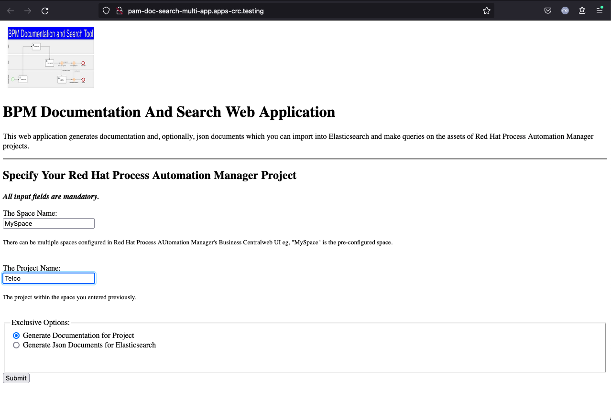
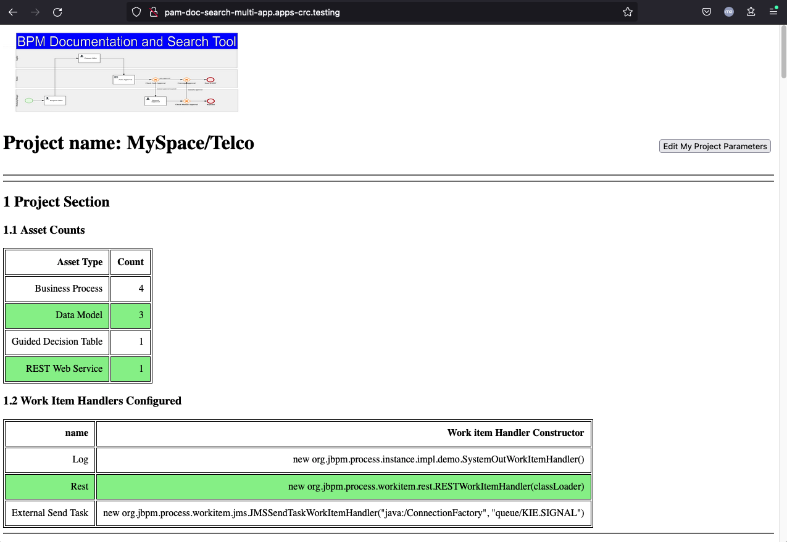
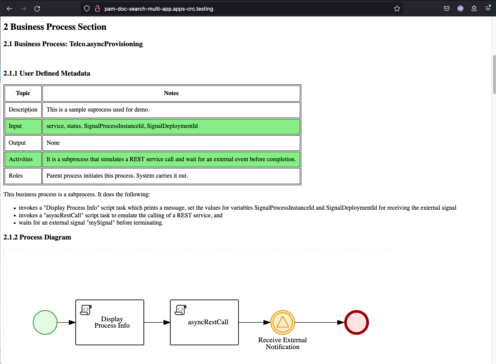
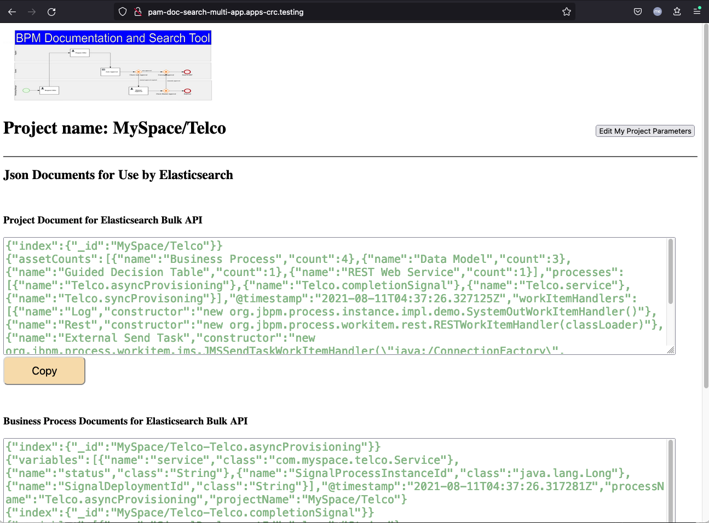
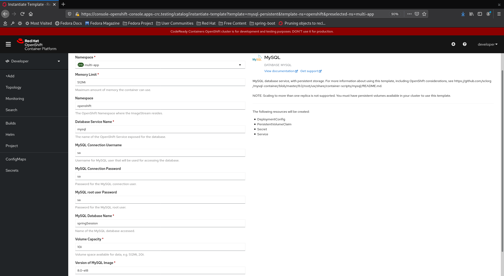
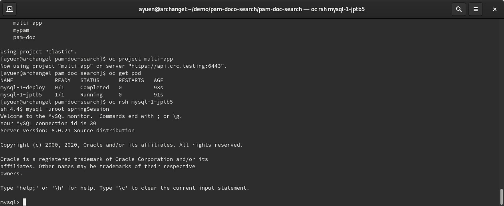
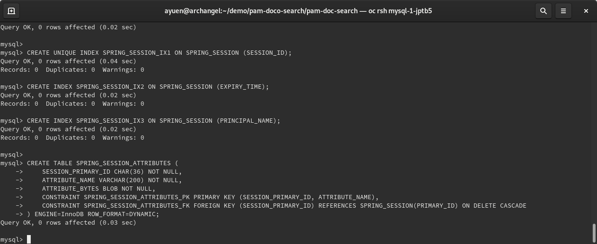

# Adding documentation and asset search capabilities to PAM

## Problem statement

Customers want to use PAM for both documentation and execution purposes. They want their PAM projects to be their a single source of truth ... but
* PAM is not designed as a documentation tool
* PAM allows you to add  metadata to the assets you create but no search capabilities
* Customers want a powerful search capability

## Design objectives

My objectives are to:
* Provide documentation/search capabilities in a non-intrusive way
* Not affect normal usage of Business Central and workflow of PAM development
* Create a quick prototype for Proof of Concept
* Add improvements later in future iterations

## Features implemented

Implemented features include:
* PAM users can use markdown (a markup language) to provide metadata in assets created using Business Central
* One click generates PAM project documentation
* One click generates PAM project json documents for Elasticsearch (manual import for now)
* Uses the power of Elasticsearch/Kibana full-text search to ask questions regarding projects and processes and their assets

## User interface and output
Here is a sreenshot of the UI:

Here is a couple of screenshots of the documentation output. You will find a PDF copy of the complete generated documentation in the root directory named documentSample.pdf

And here is a screenshot of JSON docuemt output which you can import into Kibana/Elasticsearch.

Examples of importing the data, and useful searches, as seen in video #3 in a later section, can be found in the file: 'searchSamples.txt'. Note that they should be executed in Kibana's Management->DevTools tab.

## Running Spring Boot Locally
<pre>
    mvn clean spring-boot:run
</pre>

## Deploying to Openshift
Do the following:
* Log in to Openshift
* Create a new Openshift project: pam-doc
* Make sure you are on that project
* Change directory to the root of your pam-doc project
* Deploy a MySQL database and set it up with the schema using the schema-mysql.sql (see screenshots in next section).
* Deploy Kibana/Elasticsearch using the Elasticsearch (ECK) Operator. This is required only if you want to use the asset search capability. It is not required if you just want to generate documentation for your project. 
* Change the following entries in the application properties file to point to your PAM.
<pre>
# application parameters (change to use your PAM URL and login)
app.git.url=https://pam-rhdmcentr-mypam.apps-crc.testing/git/
app.git.username=yourUser
app.git.password=yourPassword
</pre>
* execute the following commands:
<pre>
	mvn clean -Pprod package
	oc new-project pam-doc
	oc policy add-role-to-user view -z default
	oc create configmap pam-doc-search --from-file=target/classes/application.properties
	mvn oc:build
	mvn oc:resource
	mvn oc:apply
</pre>

Please note that you need to execute the package mvn goal before creating the configmap as mvn changes the application.properties file before copying it to the target directory.
* invoke the application using its route

## Database deployment screenshots
* Use Openshift templates to create a MySQL database with persistent storage.

* Identify the MySQL pod, rsh into it and login to MySQL as root:

* Paste the SQL script to create the scehma

## Videos

You can see my 3 videos on this tool:
1. 

2. 

3. 

## ENJOY ;-) !!! 